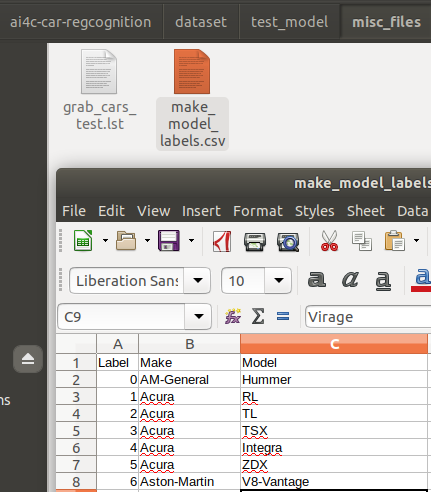

# Car Regcognition

## Introduction

## Approach

## Usage
### Setup environment
This project is using python 3.6.8 & virtualenv to create virtual environment name (ai4c).
```bash
$ sudo apt-get install python3-pip
$ sudo pip3 install virtualenv
$ virtualenv ai4c
$ source ai4c/bin/activate
```
If you are using other python version (>3.6), please be noted to update the IM2REC_PY_PATH. 
```
im2rec_path = "ai4c/lib/python3.6/site-packages/mxnet/tools/im2rec.py"
```

### Install required packages
Once (ai4c) environment is activated, installed required packages as listed in requirement.txt
It is important to use same version of packages to prevent unexpected incompatible during running script.
```bash
pip install -r requirements.txt
```

### Prepare dataset
The directory looks as below, however we need to download 3 more additional file to get the project fully operation for pre-process, train & test.
* Full statandford car dataset: http://imagenet.stanford.edu/internal/car196/car_ims.tgz
* Pretrain VGGNet model: https://1drv.ms/u/s!ApCwaWTCCxjag6lgxPQL1K-H--mUYg?e=Yxo9zI
* My own model (this is the training result): https://1drv.ms/u/s!ApCwaWTCCxjag6lhHlAq1pjOCu69Ow?e=kFhdlS

Note:
* All images from car dataset are put into `dataset/train_model/car_ims`
* The pre-trained files (vgg16-0000.params & vgg16-symbol.json) will be put in `vgg16` folder
* The model used for testing final result is supposed to be in `checkpoints` folder

```bash
.
├── checkpoints
├── config.py
├── dataset
│   ├── test_model
│   │   ├── grab_cars
│   │   │   ├── grab_car1_0_AM-General_Hummer.jpg
│   │   │   ├── grab_car2_2_Acura_TL.jpg
│   │   │   ├── grab_car3_3_TSX_Sedan.jpg
│   │   │   ├── grab_car4_35_Bugatti_Veyron-16.4.jpg
│   │   │   └── grab_car5_114_Jaguar_XK.jpg
│   │   └── misc_files
│   │       ├── grab_cars_test.idx
│   │       ├── grab_cars_test.lst
│   │       ├── grab_cars_test.rec
│   │       └── make_model_labels.csv
│   └── train_model
│       ├── car_ims
│       └── misc_files
│           ├── test.lst
│           ├── train.lst
│           └── val.lst
├── db_design
│   ├── db.sqlite
│   └── full_dataset.csv
├── logs
│   ├── preprocessing.log
│   ├── testing_85.log
│   └── training_50.log
├── media
│
├── plot.py
├── preprocess.py
├── README.md
├── requirements.txt
├── test.py
├── train.py
├── utils.py
└── vgg16
```

### How to start the test with images not in original dataset
* Put all desired photos to be tested in `./dataset/test_model/grabcars`
* Prepare the `.lst` file in `./dataset/test_model/misc_files` as a input for mxnet producing `.rec` files for testing process. There are available sample of `.lst` files for reference. The structure of list file is as below (refer [HERE](https://mxnet.incubator.apache.org/versions/master/faq/recordio.html)):
> > integer_image_index \t label_index \t path_to_image
For the label_index, please use the label column for reference from  `make_model_labels.csv` in same directory. 


 {:height="50%" width="50%"}


* 